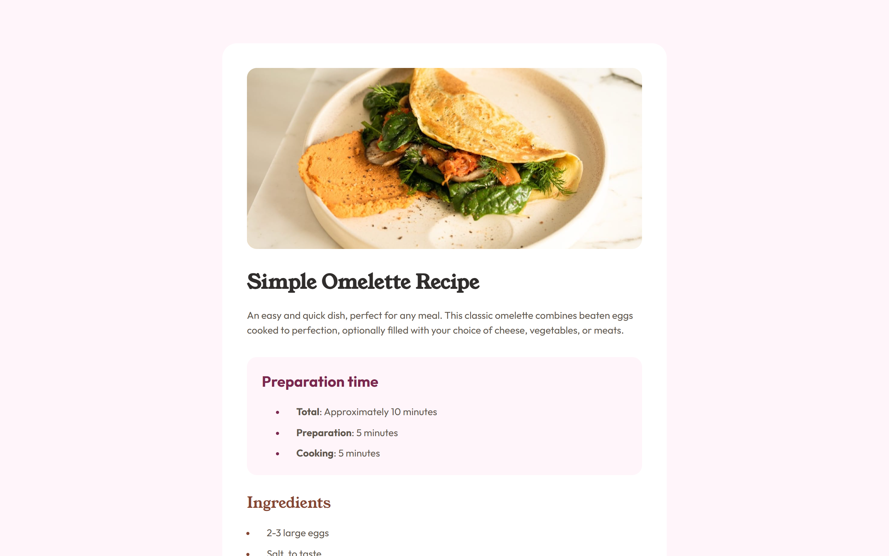

# Frontend Mentor - Recipe page solution

This is a solution to the [Recipe page challenge on Frontend Mentor](https://www.frontendmentor.io/challenges/recipe-page-KiTsR8QQKm). This challenge hellped me improve my HTML, CSS

## Overview

### Screenshot

### Links

- Solution URL: [ PAges]()
- Live Site URL: [Live Site](https://Erik5CA.github.io/recipe-page/)

## My process

### Built with

- Semantic HTML5 markup
- CSS custom properties
- Flexbox
- CSS Grid
- Mobile-first workflow

### Characteristics

- The page is responsive and looks great on all devices
- Use semantic HTML5 markup
- The page is mobile-first
- Minimal styling

## My socia media

### linkedin - [Add your social media links here](https://www.linkedin.com/in/erik-castillo-b48b12239)
